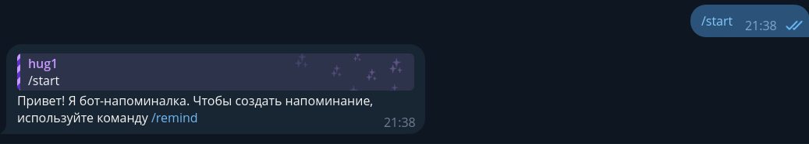
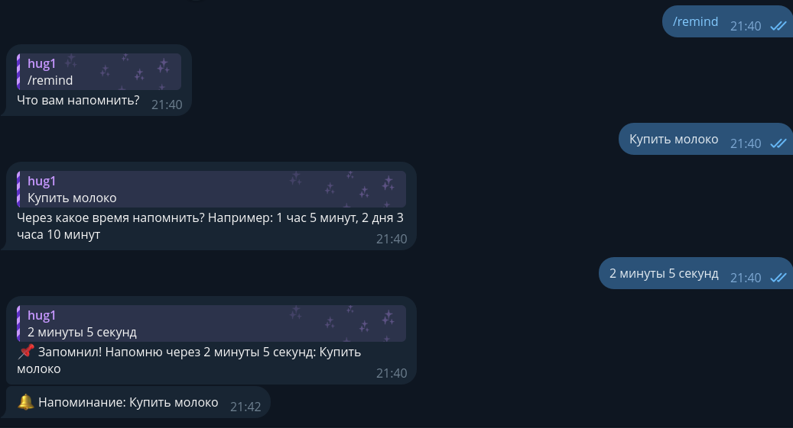

# TGReminder
Простой бот для напоминания каких-то важных дел. Короче говоря, напоминалка

# Как использовать?
Сначала, вам надо установить Python и зависимости бота.

# Скачиваем TGReminder:
``` shell
git clone https://github.com/nnqnn/TGReminder
```
# Вам надо быть в `TGReminder` для дальнейшей работы:
``` shell
cd TGReminder
```

# Устанавливаем зависимости

**Допустим, вы уже установили python3**

Далее:

``` shell
pip install pip --upgrade
pip install -r requirements.txt
```

После этого вы должны заполнить `config.py`, добавив ваш `BOT_TOKEN`.

# Запускаем
```shell
python main.py
```
# Картинки-примеры
<table>
  <tr>
    <td>Картинка 1</td>
    <td></td>
  </tr>
  <tr>
    <td>Картинка 2</td>
    <td></td>
  </tr>
</table>

